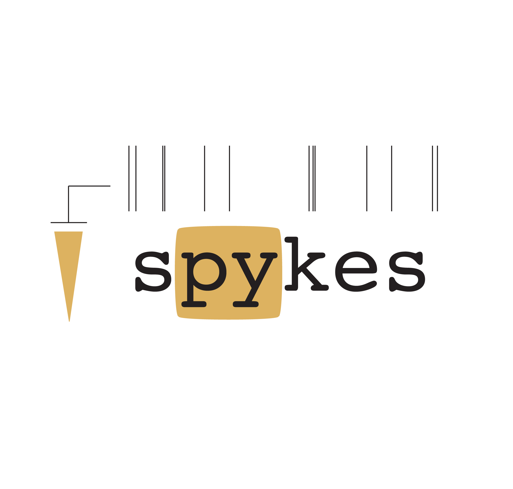

# spykes
made a change
branch
[](https://github.com/KordingLab/spykes/blob/master/LICENSE) [](https://gitter.im/KordingLab/spykes?utm_source=badge&utm_medium=badge&utm_campaign=pr-badge&utm_content=badge)
[](https://travis-ci.org/KordingLab/spykes)
[](https://circleci.com/gh/KordingLab/spykes/tree/master.svg?style=shield&circle-token=:circle-token)
[](https://coveralls.io/github/KordingLab/spykes?branch=master)



Almost any electrophysiology study of neural spiking data relies on a battery of standard analyses.
Raster plots and peri-stimulus time histograms aligned to stimuli and behavior provide a snapshot visual description of neural activity. Similarly, tuning curves are the most standard way to characterize how neurons encode stimuli or behavioral preferences. With increasing popularity of population recordings, maximum-likelihood decoders based on tuning models are becoming part of this standard.

Yet, virtually every lab relies on a set of in-house analysis scripts to go from raw data to summaries. We want to improve this status quo in order to enable easier sharing, better reproducibility and fewer bugs.

Spykes is a collection of Python tools to make the visualization and analysis of neural data easy and reproducible.

At present, spykes comes with four classes:
- ```NeuroVis``` helps you plot beautiful spike rasters and peri-stimulus time histograms (PSTHs).
- ```PopVis``` helps you plot population summaries of PSTHs as normalized averages or heat maps.
- ```NeuroPop``` helps you estimate tuning curves of neural populations and decode stimuli from population vectors with maximum-likelihood decoding.
- ```STRF``` helps you estimate spatiotemporal receptive fields.

```Spykes``` deliberately does not aim to provide tools for spike sorting or file i/o with popular electrophysiology formats, but only aims to fill the missing niche for neural data analysis and easy visualization. For file i/o, see [Neo](http://neuralensemble.org/neo/) and [OpenElectrophy](http://neuralensemble.org/OpenElectrophy/). For spike sorting, see [Klusta](http://klusta.readthedocs.io/en/latest/).

Documentation, tutorials and examples are coming soon! Check out the notebooks for now.


### Installation

Clone the repository.

```bash
$ git clone http://github.com/KordingLab/spykes
```

Install `spykes` using `pip` as follows

```bash
$ cd spykes
$ pip install -e ./
```

### How to use ```NeuroVis```?

See:
- [CRCNS Dataset Example](http://kordinglab.com/spykes/auto_examples/plot_crcns_dataset_example.html#sphx-glr-auto-examples-plot-crcns-dataset-example-py)
- [Reaching Dataset Example](http://kordinglab.com/spykes/auto_examples/plot_reaching_dataset_example.html#sphx-glr-auto-examples-plot-reaching-dataset-example-py)
- [Neural Coding Reward Example](http://kordinglab.com/spykes/auto_examples/plot_neural_coding_reward_example.html#sphx-glr-auto-examples-plot-neural-coding-reward-example-py)

### How to use ```PopVis```?
See:
- [PopVis Example](http://kordinglab.com/spykes/auto_examples/plot_popvis_example.html#sphx-glr-auto-examples-plot-popvis-example-py)
- [Neuropixels Example](http://kordinglab.com/spykes/auto_examples/plot_neuropixels_example.html#sphx-glr-auto-examples-plot-neuropixels-example-py)

### How to use ```NeuroPop```?

See:
- [Neuropop Simul Example](http://kordinglab.com/spykes/auto_examples/plot_neuropop_simul_example.html#sphx-glr-auto-examples-plot-neuropop-simul-example-py)
- [Reaching Dataset Example](http://kordinglab.com/spykes/auto_examples/plot_reaching_dataset_example.html#sphx-glr-auto-examples-plot-reaching-dataset-example-py)

### Dependencies

Already distributed with [Anaconda](https://www.continuum.io/downloads) and [Canopy](https://www.enthought.com/products/canopy/).
- ```NumPy``` >= 1.6.1
- ```SciPy``` >= 0.14
- ```Matplotlib``` >= 1.5

### Datasets

The examples use real datasets. Instructions for downloading these datasets are included in the notebooks. We recommend [deepdish](https://github.com/uchicago-cs/deepdish) for reading the HDF5 datafile.

### Authors

* [Pavan Ramkumar](http:/github.com/pavanramkumar)
* [Hugo Fernandes](http:/github.com/hugoguh)

### Acknowledgments

* [Konrad Kording](http://kordinglab.com) for funding and support
