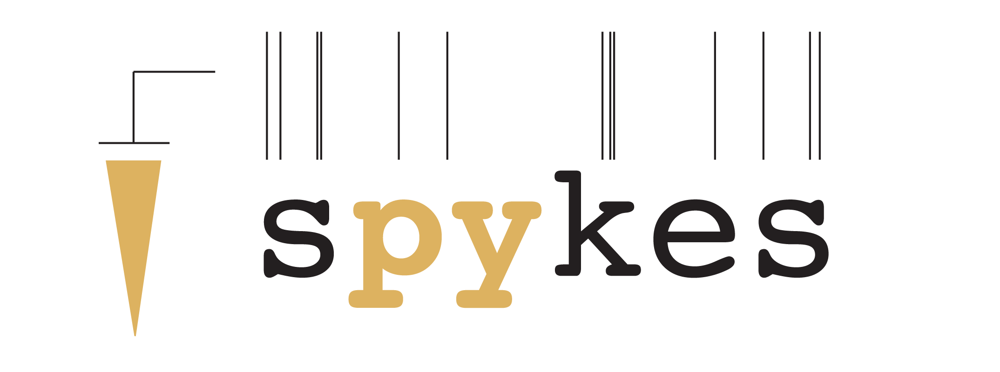

# spykes

[](https://github.com/KordingLab/spykes/blob/master/LICENSE) [](https://gitter.im/KordingLab/spykes?utm_source=badge&utm_medium=badge&utm_campaign=pr-badge&utm_content=badge)
[](https://travis-ci.org/KordingLab/spykes)
[](https://circleci.com/gh/KordingLab/spykes/tree/master.svg?style=shield&circle-token=:circle-token)
[](https://coveralls.io/github/KordingLab/spykes?branch=master)



Almost any electrophysiology study of neural spiking data relies on a battery of standard analyses. Raster plots and peri-stimulus time histograms aligned to stimuli and behavior provide a snapshot visual description of neural activity. Similarly, tuning curves are the most standard way to characterize how neurons encode stimuli or behavioral preferences. With increasing popularity of population recordings, maximum-likelihood decoders based on tuning models are becoming part of this standard.

Yet, virtually every lab relies on a set of in-house analysis scripts to go from raw data to summaries. We want to improve this status quo in order to enable easier sharing, better reproducibility and fewer bugs.

Spykes is a collection of Python tools to make the visualization and analysis of neural data easy and reproducible.

For more, see the [documentation](http://kordinglab.com/spykes/getting-started.html).

### Installation

Spykes can be installed using

```
pip install spykes
```

For more detailed installation options, see the [documentation](http://kordinglab.com/spykes/getting-started.html#installing).

### Authors

- [Pavan Ramkumar](http:/github.com/pavanramkumar)
- [Hugo Fernandes](http:/github.com/hugoguh)

### Acknowledgments

* [Konrad Kording](http://kordinglab.com) for funding and support
