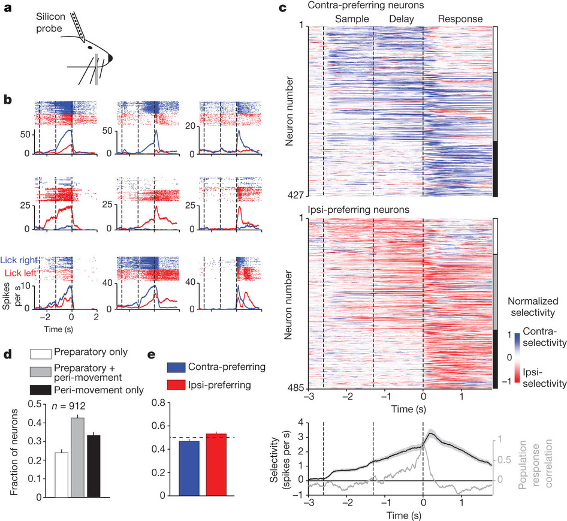
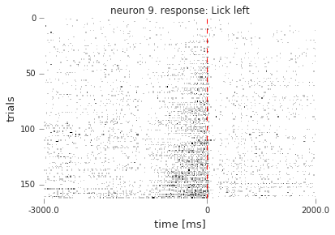
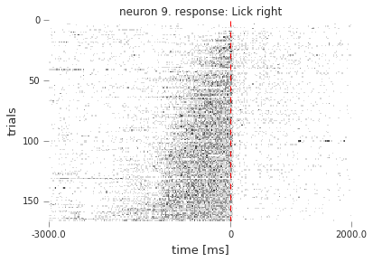
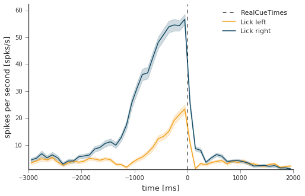
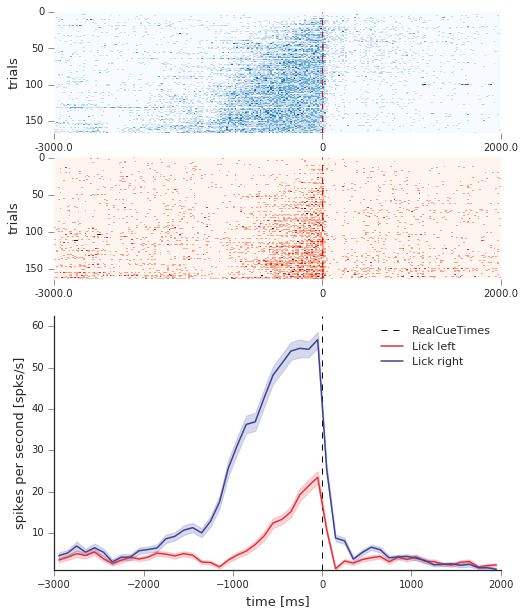
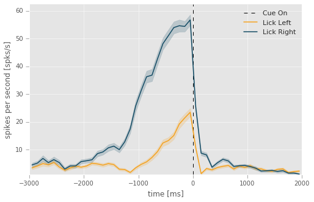

CRCNS Dataset Example
=================================================================

.. code:: python

    import warnings
    warnings.filterwarnings('ignore')
    
    %matplotlib inline
    import matplotlib.pyplot as plt
    plt.style.use('seaborn-ticks')
    
    import numpy as np
    import pandas as pd
    from spykes.neurovis import NeuroVis

0 Overview: Reproduce Figure
--------------------

0.1 Article
~~~~~~~~~~~~~

Nuo Li, Tsai-Wen Chen, Zengcai V. Guo, Charles R. Gerfen & Karel
Svoboda. A motor cortex circuit for motor planning and movement. Nature
519, 51–56 (05 March 2015) PMID: 25731172 doi: 10.1038/nature14178
[`link to
paper <http://www.nature.com/nature/journal/v519/n7541/full/nature14178.html>`__]

0.2 Dataset
~~~~~~~~~~~~~~~~~~~~~~~~~~~~~~~~~~~~~~~~~~~~~~

Nuo Li, Charles R Gerfen, Karel Svoboda (2014); Extracellular recordings
from anterior lateral motor cortex (ALM) neurons of adult mice
performing a tactile decision behavior. CRCNS.org [`link to
dataset <https://crcns.org/data-sets/motor-cortex/alm-1>`__]

0.3 Figure
~~~~~~~~~~~~~~~~

This is what we want to reproduce.

.. code:: python

    from IPython.display import Image
    from IPython.core.display import HTML 
    
    Image(filename="./figures/nature14178-f2.jpg", width=650)

1 Data
--------------------

1.1 Download Data
~~~~~~~~~~~~~~~~~

Register in ``CRCNS`` [`link to request account <https://crcns.org/request-account>`__]

Download file ``data_structure_ANM218457.tar.gz`` [`link <https://portal.nersc.gov/project/crcns/download/alm-1/datafiles/data_structure_files>`__]

Unzip it and you will find file ``data_structure_ANM218457_20131006.mat``

1.2 Load Data
~~~~~~~~~~~~~

.. code:: python

    import scipy.io
    mat = scipy.io.loadmat('data_structure_ANM218457_20131006')

2 Get Spike Times
--------------------

.. code:: python

    neuron_n = 9
    spike_times = mat['obj']['eventSeriesHash'][0][0]['value'][0][0][0][neuron_n-1][0][0][1]
    spike_times = [i[0] for i in spike_times]
    
    # instantiate neuron
    neuron = NeuroVis(spike_times, neuron_n)
    print 'neuron %d has a firing rate of %0.2f spikes per second' % (neuron_n, neuron.firingrate)

.. parsed-literal::

    neuron 9 has a firing rate of 5.07 spikes per second

Let's use all the goodness of ``pandas`` to define all our conditions.
Here, we will create a set of extra columns in the data frame that are
going to be useful to select and plot PSTHs for specific conditions. We
aim to follow the principles outlined in `Hadley Wickam's white paper on
Tidy Data <http://vita.had.co.nz/papers/tidy-data.pdf>`__.

3. Get Event Times
--------------------

.. code:: python

    data_df = pd.DataFrame()
    data_df['trialStart'] = mat['obj']['trialStartTimes'][0][0][0]
    data_df['cueTimes'] = np.squeeze(mat['obj']['trialPropertiesHash'][0][0][0][0][2][0][2])
    data_df['RealCueTimes'] = data_df['trialStart'] + data_df['cueTimes']
    
    # Collect all the events and display them
    events = ['trialStart', 'cueTimes', 'RealCueTimes']
    data_df[events].head()

.. raw:: html

    

    <table border="1" class="dataframe">
      <thead>
        <tr style="text-align: right;">
          <th></th>
          <th>trialStart</th>
          <th>cueTimes</th>
          <th>RealCueTimes</th>
        </tr>
      </thead>
      <tbody>
        <tr>
          <th>0</th>
          <td>2.261389</td>
          <td>0.000000</td>
          <td>2.261389</td>
        </tr>
        <tr>
          <th>1</th>
          <td>437.238815</td>
          <td>5.784644</td>
          <td>443.023459</td>
        </tr>
        <tr>
          <th>2</th>
          <td>448.597437</td>
          <td>3.172654</td>
          <td>451.770091</td>
        </tr>
        <tr>
          <th>3</th>
          <td>457.379402</td>
          <td>7.776468</td>
          <td>465.155870</td>
        </tr>
        <tr>
          <th>4</th>
          <td>470.885681</td>
          <td>3.322320</td>
          <td>474.208001</td>
        </tr>
      </tbody>
    </table>
    

4. Get Features
--------------------

.. code:: python

    trialTypeMat = mat['obj']['trialTypeMat'][0][0].astype(np.bool_)
    trialTypeStr = np.squeeze(np.stack(np.squeeze(mat['obj']['trialTypeStr'][0][0])))
    
    for ind, feat in enumerate(trialTypeStr):
        data_df[str(feat)] = trialTypeMat[ind]
    
    data_df['GoodTrials'] = np.squeeze(mat['obj']['trialPropertiesHash'][0][0][0][0][2][0][3]).astype(np.bool_)
    
    # Collect all features and display them
    features = ['HitR', 'HitL', 'ErrR', 'ErrL', 'NoLickR', 'NoLickL', 'LickEarly', 'StimTrials', 'GoodTrials']
    data_df[features].head()

.. raw:: html

    

    <table border="1" class="dataframe">
      <thead>
        <tr style="text-align: right;">
          <th></th>
          <th>HitR</th>
          <th>HitL</th>
          <th>ErrR</th>
          <th>ErrL</th>
          <th>NoLickR</th>
          <th>NoLickL</th>
          <th>LickEarly</th>
          <th>StimTrials</th>
          <th>GoodTrials</th>
        </tr>
      </thead>
      <tbody>
        <tr>
          <th>0</th>
          <td>False</td>
          <td>False</td>
          <td>False</td>
          <td>False</td>
          <td>False</td>
          <td>False</td>
          <td>False</td>
          <td>False</td>
          <td>True</td>
        </tr>
        <tr>
          <th>1</th>
          <td>True</td>
          <td>False</td>
          <td>False</td>
          <td>False</td>
          <td>False</td>
          <td>False</td>
          <td>True</td>
          <td>True</td>
          <td>True</td>
        </tr>
        <tr>
          <th>2</th>
          <td>True</td>
          <td>False</td>
          <td>False</td>
          <td>False</td>
          <td>False</td>
          <td>False</td>
          <td>False</td>
          <td>True</td>
          <td>True</td>
        </tr>
        <tr>
          <th>3</th>
          <td>True</td>
          <td>False</td>
          <td>False</td>
          <td>False</td>
          <td>False</td>
          <td>False</td>
          <td>True</td>
          <td>True</td>
          <td>True</td>
        </tr>
        <tr>
          <th>4</th>
          <td>False</td>
          <td>False</td>
          <td>False</td>
          <td>True</td>
          <td>False</td>
          <td>False</td>
          <td>True</td>
          <td>True</td>
          <td>True</td>
        </tr>
      </tbody>
    </table>
    

5 Define Features
--------------------

.. code:: python

    features_of_interst = ['HitR','HitL', 'ErrR', 'ErrL']
    
    data_df['response'] = data_df[features_of_interst].apply(lambda row: row.argmax() if row.max()==True else '',axis=1)
    data_df['correct'] = data_df['response'].map(lambda s: {'Hit':True,'Err':False,'':np.nan}[s[:3]])
    data_df['response'] = data_df['response'].map(lambda s: {'L':'Lick left','R':'Lick right','':''}[s[-1:]])
    
    data_df[['HitR','HitL', 'ErrR', 'ErrL','correct','response']].head()

.. raw:: html

    

    <table border="1" class="dataframe">
      <thead>
        <tr style="text-align: right;">
          <th></th>
          <th>HitR</th>
          <th>HitL</th>
          <th>ErrR</th>
          <th>ErrL</th>
          <th>correct</th>
          <th>response</th>
        </tr>
      </thead>
      <tbody>
        <tr>
          <th>0</th>
          <td>False</td>
          <td>False</td>
          <td>False</td>
          <td>False</td>
          <td>NaN</td>
          <td></td>
        </tr>
        <tr>
          <th>1</th>
          <td>True</td>
          <td>False</td>
          <td>False</td>
          <td>False</td>
          <td>True</td>
          <td>Lick right</td>
        </tr>
        <tr>
          <th>2</th>
          <td>True</td>
          <td>False</td>
          <td>False</td>
          <td>False</td>
          <td>True</td>
          <td>Lick right</td>
        </tr>
        <tr>
          <th>3</th>
          <td>True</td>
          <td>False</td>
          <td>False</td>
          <td>False</td>
          <td>True</td>
          <td>Lick right</td>
        </tr>
        <tr>
          <th>4</th>
          <td>False</td>
          <td>False</td>
          <td>False</td>
          <td>True</td>
          <td>False</td>
          <td>Lick left</td>
        </tr>
      </tbody>
    </table>
    

Let's put the events and the augmented features into a new data frame
which we will use everywhere below.

.. code:: python

    # isolate trials of interest
    trials_df = data_df[(
                        (data_df['GoodTrials']==True) &
                        (data_df['correct']==True)
                        )]

6 Plots
--------------------

6.1 Rasters
~~~~~~~~

.. code:: python

    event = 'RealCueTimes'
    conditions='response'
    window = [-3000,2000]
    
    rasters_fig2b1 = neuron.get_raster(event=event,
                                       conditions=conditions,
                                       df=trials_df,
                                       window=window,
                                       binsize=20,
                                       sortby='rate',
                                       sortorder='ascend');

6.2 PSTH
~~~~~

.. code:: python

    plt.figure(figsize=(8,5))
    neuron.get_psth(event=event,
                    df=trials_df,
                    conditions=conditions,
                    window=window,
                    binsize=100);
    plt.title('')
    plt.show()

6.3 Reproduce Figure
~~~~~~~~~~~~~

.. code:: python

    plt.style.use('seaborn-ticks')
    
    cmap = [plt.get_cmap('Blues'), plt.get_cmap('Reds')]
    colors = ['#E82F3A', '#3B439A']
    
    
    #get rasters------------------------------------------------------
    rasters_fig2b1 = neuron.get_raster(event=event,
                                       conditions=conditions,
                                       df=trials_df,
                                       window=window,
                                       binsize=20,
                                       plot=False);
    
    
    
    plt.figure(figsize=(8,10))
    cond_ids = rasters_fig2b1['data'].keys()[::-1]
    
    #plot rasters-------------------------------------------------------
    for i, cond_id in enumerate(cond_ids):
        plt.subplot(4,1,i+1)
        neuron.plot_raster(rasters=rasters_fig2b1,
                           cond_id=cond_id,
                           cmap=cmap[i],
                           sortby=None,
                           has_title=False)
        plt.xlabel('')
        
        
    #plot psth-------------------------------------------------------    
    plt.subplot(212)
    psth = neuron.get_psth(event=event,
                    conditions=conditions,
                    df=trials_df,
                    window=window,
                    binsize=100,
                    plot=True,
                    colors=colors);
    plt.title('')
    plt.show()

6.4 ggplot
~~~~~~

.. code:: python

    plt.style.use('ggplot')
    
    plt.figure(figsize=(8,5))
    neuron.get_psth(event=event,
                    conditions=conditions,
                    df=trials_df,
                    event_name='Cue On',
                    window=window,
                    conditions_names=['Lick Left', 'Lick Right'],
                    binsize=100);
    plt.title('')
    plt.show()

