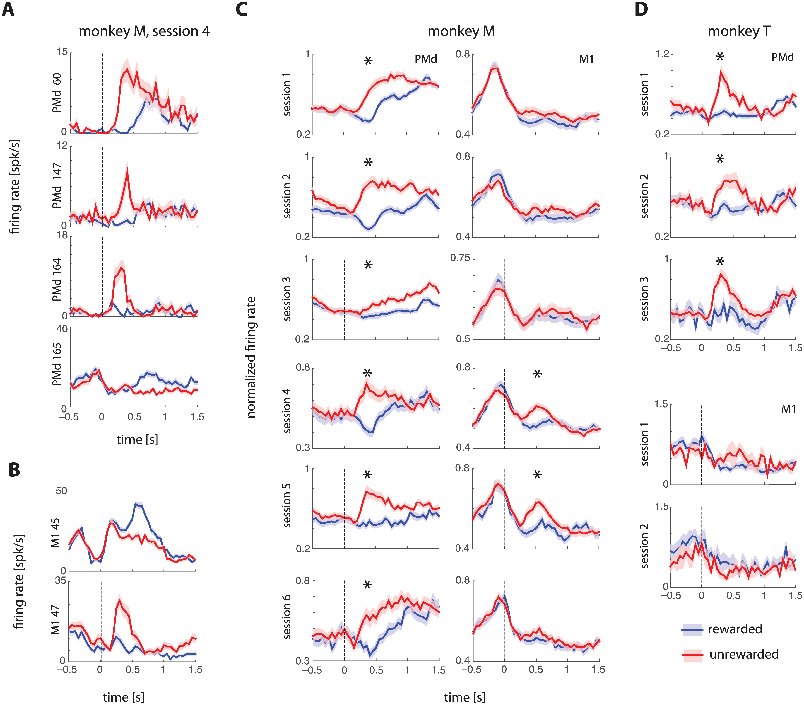
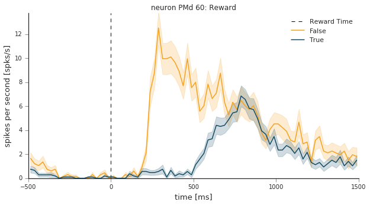
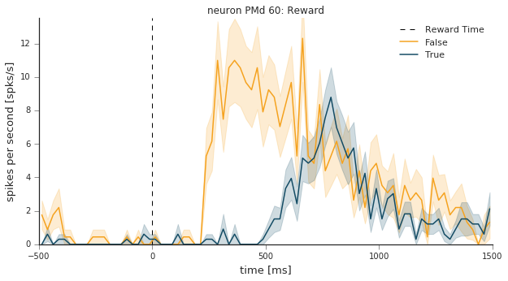
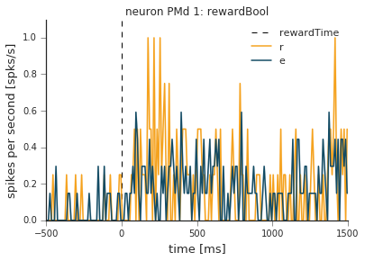
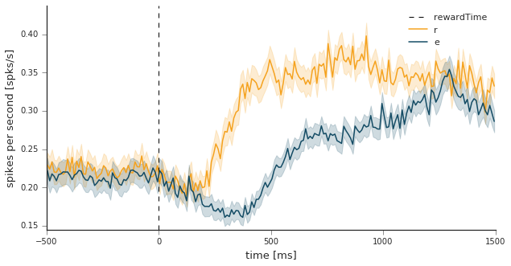

Neural Coding Reward Example
============================
.. code:: python

    import warnings
    warnings.filterwarnings('ignore')
    
    %matplotlib inline
    import matplotlib.pyplot as plt
    plt.style.use('seaborn-ticks')
    
    import numpy as np
    import pandas as pd
    from spykes.neurovis import NeuroVis

0 Reproduce Figure
-----------------

0.1 Article
~~~~~~~~~~~~~

Ramkumar, Pavan, et al. "Premotor and Motor Cortices Encode Reward."
PloS one 11.8 (2016): e0160851. [`link to
paper <http://journals.plos.org/plosone/article?id=10.1371/journal.pone.0160851>`__]

0.2 Figure
~~~~~~~~~~~~~~~~

.. code:: python

    from IPython.display import Image
    from IPython.core.display import HTML 
    
    Image(filename="./figures/journal.pone.0160851.g002.PNG", width=650)

1 Initialization
-----------------

0.1 Download Data
~~~~~~~~~~~~~~~~

Download all files [`here <https://figshare.com/articles/Ramkumar_et_al_2016_Premotor_and_motor_cortices_encode_reward/3573447>`__]. However, we'll only be looking at Mihili\_07112013.mat (Monkey M, Session 1) and Mihili\_08062013.mat (Monkey M, Session 4)

0.2 Initialize Variables
~~~~~~~~~~~~~~~~

.. code:: python

    event = 'rewardTime'
    condition = 'rewardBool'
    window = [-500, 1500]
    binsize = 10

1. First Graph of Panel A
--------------------------------------------

(The other graphs in A & B are done the same way, just a different neuron number or switching PMd for M1)

.. code:: python

    import scipy.io
    mat = scipy.io.loadmat('3573447/Mihili_08062013.mat')

1.1. Initiate all Neurons
~~~~~~~~~~~~~~~~~~~~~~~~~

.. code:: python

    def get_spike_time(raw_data, neuron_number):
        
        spike_times = raw_data['alldays'][0]['PMd_units'][0][:][neuron_number-1][0][1:]
        spike_times = [i[0] for i in spike_times]
        
        return spike_times

.. code:: python

    def initiate_neurons(raw_data):
        
        neuron_list = list()
        
        for i in range((raw_data['alldays'][0]['PMd_units'][0][:]).shape[0]):
            spike_times = get_spike_time(raw_data, i+1)
    
            # instantiate neuron
            neuron = NeuroVis(spike_times, name = 'PMd %d' % (i+1))
            neuron_list.append(neuron)
            
        return neuron_list

.. code:: python

    neuron_list = initiate_neurons(mat)

1.2. Get Event Times
~~~~~~~~~~~~~~~~~~~~

.. code:: python

    def create_data_frame(raw_data):
    
        data_df = pd.DataFrame()
        
        uncertainty_conditions = list()
        center_target_times = list()
        reward_times = list()
        reward_outcomes = list()
        
        for i in range(raw_data['alldays'].shape[0]):
                
            meta_data = raw_data['alldays'][i]['tt'][0]
            
            uncertainty_conditions.append(meta_data[:,2])
            center_target_times.append(meta_data[:,3])
            reward_times.append(meta_data[:,6])
            reward_outcomes.append(meta_data[:,7])
            
        data_df['uncertaintyCondition'] = np.concatenate(uncertainty_conditions)
        data_df['centerTargetTime'] = np.concatenate(center_target_times)
        data_df['rewardTime'] = np.concatenate(reward_times)
        data_df['rewardOutcome'] = np.concatenate(reward_outcomes)
            
        data_df['rewardBool'] = data_df['rewardOutcome'].map(lambda s: s == 32)
        
        # find time in between previous reward onset and start of current trial
        # shouldn't be more than 1500ms
        
        start_times = data_df['centerTargetTime']
        last_reward_times = np.roll(data_df['rewardTime'], 1)
        
        diffs = start_times - last_reward_times
        diffs[0] = 0
        
        data_df['consecutiveBool'] = diffs.map(lambda s: s <= 1.5)
            
        return data_df[((data_df['uncertaintyCondition'] == 5.0) | (data_df['uncertaintyCondition'] == 50.0)) 
                      & data_df['consecutiveBool']]    
        

.. code:: python

    data_df = create_data_frame(mat)
    data_df.head()

.. raw:: html

    

    <table border="1" class="dataframe">
      <thead>
        <tr style="text-align: right;">
          <th></th>
          <th>uncertaintyCondition</th>
          <th>centerTargetTime</th>
          <th>rewardTime</th>
          <th>rewardOutcome</th>
          <th>rewardBool</th>
          <th>consecutiveBool</th>
        </tr>
      </thead>
      <tbody>
        <tr>
          <th>280</th>
          <td>5.0</td>
          <td>1481.082633</td>
          <td>1483.947</td>
          <td>34.0</td>
          <td>False</td>
          <td>True</td>
        </tr>
        <tr>
          <th>284</th>
          <td>5.0</td>
          <td>1509.540300</td>
          <td>1511.946</td>
          <td>34.0</td>
          <td>False</td>
          <td>True</td>
        </tr>
        <tr>
          <th>285</th>
          <td>5.0</td>
          <td>1513.181333</td>
          <td>1515.847</td>
          <td>32.0</td>
          <td>True</td>
          <td>True</td>
        </tr>
        <tr>
          <th>286</th>
          <td>5.0</td>
          <td>1516.982767</td>
          <td>1519.256</td>
          <td>32.0</td>
          <td>True</td>
          <td>True</td>
        </tr>
        <tr>
          <th>287</th>
          <td>50.0</td>
          <td>1520.391233</td>
          <td>1523.123</td>
          <td>32.0</td>
          <td>True</td>
          <td>True</td>
        </tr>
      </tbody>
    </table>
    

1.3. Match Peak Velocities
~~~~~~~~~~~~~~~~~~~~~~~~~~

(Peak velocities must be in between 11 and 16 cm/s)

.. code:: python

    def find_velocities_in_range(raw_data, dataframe, min_vel, max_vel, min_time, max_time):  
        
        all_velocities = raw_data['alldays'][0]['kin'][0]['vel'][0][0]
    
        max_velocities = np.empty(len(dataframe))
        peak_times = np.empty(len(dataframe))
    
        for i in range(len(dataframe)):
            
            # find time range for potential peak velocity
            start_time = dataframe['rewardTime'][i] + .2
            end_time = dataframe['rewardTime'][i] + 1.5
    
            # find velocities in the time range
            indices = (all_velocities[:,0] >= start_time) & (all_velocities[:,0] <= end_time)
            in_time = all_velocities[indices]
    
            # find max velocity in given time range
            velocity_norms = np.square(in_time[:,1]) + np.square(in_time[:,2])
            
            max_velocity_index = np.argmax(velocity_norms)
            
            max_velocities[i] = velocity_norms[max_velocity_index]**.5
            peak_times[i] = in_time[max_velocity_index,0]
            
        dataframe['maxVelocity'] = max_velocities
        dataframe['peakTimesDiff'] = peak_times - dataframe['rewardTime']
        
        return dataframe[((dataframe['maxVelocity'] >= min_vel) & (dataframe['maxVelocity'] <= max_vel)) & 
                        ((dataframe['peakTimesDiff'] >= min_time) & (dataframe['peakTimesDiff'] <= max_time))]

.. code:: python

    trials_df = find_velocities_in_range(mat, data_df.reset_index(), 11, 16, .55, .95)

1.4. Plot PSTHs
~~~~~~~~~~~~~~~~~~~~~~~~~~

PSTH (before matching)

.. code:: python

    neuron_number = 60
    neuron = neuron_list[neuron_number-1]
    
    plt.figure(figsize=(10,5))
    psth = neuron.get_psth(event=event,
                               conditions=condition, 
                               df=data_df,
                               window=[-500,1500],
                               binsize=25,
                               event_name='Reward Time');
    
    plt.title('neuron %s: Reward' % neuron.name)
    plt.show()

PSTH (after velocity matching)

.. code:: python

    neuron_number = 60
    neuron = neuron_list[neuron_number-1]
    
    plt.figure(figsize=(10,5))
    psth = neuron.get_psth(event=event,
                               conditions=condition, 
                               df=trials_df,
                               window=[-500,1500],
                               binsize=25,
                               event_name='Reward Time');
    
    plt.title('neuron %s: Reward' % neuron.name)
    plt.show()

2 First Graph of Panel C
------------------------------------------

(The other graphs in C & D are done the same way, just a different session number / monkey)

.. code:: python

    mat = scipy.io.loadmat('3573447/Mihili_07112013.mat')

.. code:: python

    neuron_list = initiate_neurons(mat)

.. code:: python

    data_df = create_data_frame(mat)

2.1 Normalize
~~~~~~~~~~~~~~~~~~~~~~~~~~

This is done by setting the PSTH peaks to 1.

.. code:: python

    def normalize_psth(neuron, dataframe):
        
        psth = neuron.get_psth(event = event, 
                               conditions = condition, 
                               df = dataframe, 
                               window = window, 
                               binsize = binsize,
                               plot=False);
        
        # find all max rates, and find max of max rates
        
        max_rates = list()
        
        for i, cond_id in enumerate(np.sort(psth['data'].keys())):
            max_rates.append(np.amax(psth['data'][cond_id]['mean']))
            
        max_rate = max(max_rates)
        
        # divide all means by max to normalize
        
        for i, cond_id in enumerate(np.sort(psth['data'].keys())):
            
            psth['data'][cond_id]['mean'] /= max_rate
            psth['data'][cond_id]['sem'] = 0 # population SEM calculated later
            
        return psth

.. code:: python

    neuron = neuron_list[0] # example
    
    new_psth = normalize_psth(neuron, data_df)
    
    neuron.plot_psth(new_psth, event, condition)

2.2 Find Population Average
~~~~~~~~~~~~~~~~~~~~~~~~~~

.. code:: python

    psth_dict = {}
    for cond_id in np.sort(psth['data'].keys()):
        psth_dict[cond_id] = list()
    
    
    # add all normalized psth's
    for neuron in neuron_list:
        
        norm_psth = normalize_psth(neuron, data_df)
        
        for cond_id in np.sort(psth['data'].keys()):
            psth_dict[cond_id].append(norm_psth['data'][cond_id]['mean'])
            
    for key in psth_dict:
        psth_dict[key] = np.array(psth_dict[key])
    
    # get base psth
    
    base_neuron = neuron_list[0]
    psth = normalize_psth(base_neuron, data_df)
    
    # update mean and SEM to reflect population
            
    for cond_id in np.sort(psth['data'].keys()):
        
        psth['data'][cond_id]['mean'] = np.mean(psth_dict[cond_id], axis=0)
        psth['data'][cond_id]['sem'] = (np.var(psth_dict[cond_id], axis=0) / len(neuron_list))**.5
        

2.3 Plot PSTH
~~~~~~~~~~~~~~~~~~~~~~~~~~

.. code:: python

    plt.figure(figsize=(10,5))
    neuron.plot_psth(psth, event, condition)
    plt.title("")
    plt.show() 

