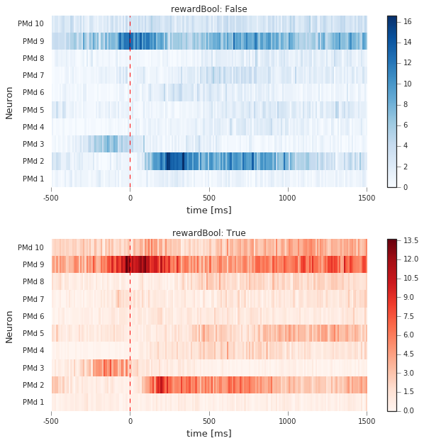
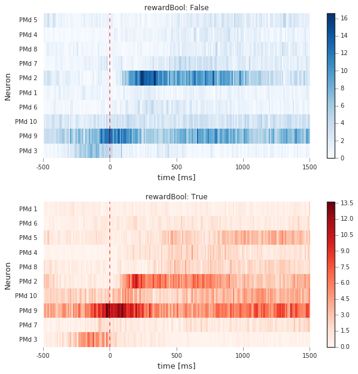
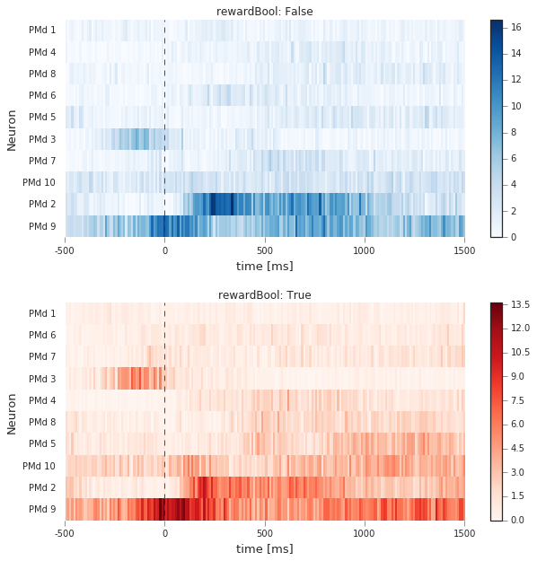
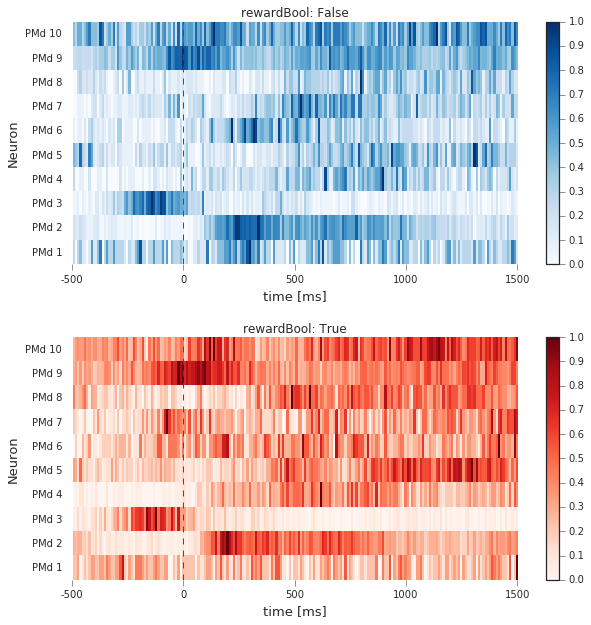
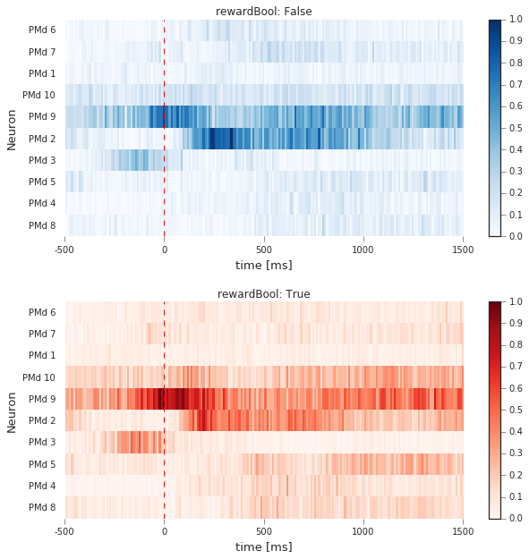
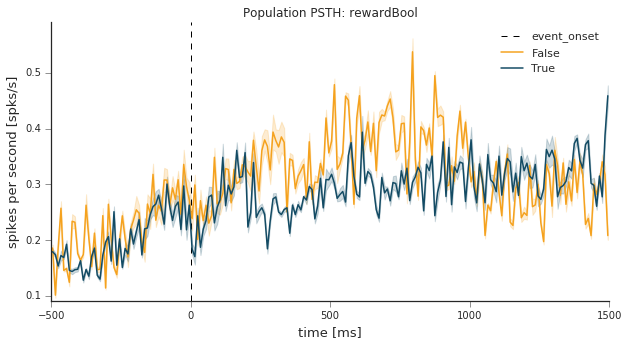

PopVis Example
===============
.. code:: python

    import warnings
    warnings.filterwarnings('ignore')
    
    %matplotlib inline
    import matplotlib.pyplot as plt
    plt.style.use('seaborn-ticks')
    
    import random
    import numpy as np
    import pandas as pd
    from spykes.neurovis import NeuroVis
    from spykes.popvis import PopVis

0 Setting Up
-------------

0.1 Download Data
~~~~~~~~~~~~~~~~~

Download all files [`here <https://figshare.com/articles/Ramkumar_et_al_2016_Premotor_and_motor_cortices_encode_reward/3573447>`__]. We'll only be looking at Mihili\_08062013.mat (Monkey M, Session 4)

0.2 Read In Data
~~~~~~~~~~~~~~~~

.. code:: python

    import scipy.io
    mat = scipy.io.loadmat('3573447/Mihili_08062013.mat')

0.3 Initialize Variables
~~~~~~~~~~~~~~~~~~~~~~~~

.. code:: python

    event = 'rewardTime'
    condition = 'rewardBool'
    window = [-500, 1500]
    binsize = 10

Using PopVis
------------

1.1. Initiate Neurons
~~~~~~~~~~~~~~~~~~~~~~~~~

.. code:: python

    def get_spike_time(raw_data, neuron_number):
        
        spike_times = raw_data['alldays'][0]['PMd_units'][0][:][neuron_number-1][0][1:]
        spike_times = [i[0] for i in spike_times]
        
        return spike_times

.. code:: python

    def initiate_neurons(raw_data):
        
        neuron_list = list()
        
        for i in range((raw_data['alldays'][0]['PMd_units'][0][:]).shape[0]):
            spike_times = get_spike_time(raw_data, i+1)
    
            # instantiate neuron
            neuron = NeuroVis(spike_times, name = 'PMd %d' % (i+1))
            neuron_list.append(neuron)
            
        return neuron_list

.. code:: python

    neuron_list = initiate_neurons(mat)

1.2. Get Event Times
~~~~~~~~~~~~~~~~~~~~

.. code:: python

    def create_data_frame(raw_data):
    
        data_df = pd.DataFrame()
        
        uncertainty_conditions = list()
        center_target_times = list()
        reward_times = list()
        reward_outcomes = list()
        
        for i in range(raw_data['alldays'].shape[0]):
                
            meta_data = raw_data['alldays'][i]['tt'][0]
            
            uncertainty_conditions.append(meta_data[:,2])
            center_target_times.append(meta_data[:,3])
            reward_times.append(meta_data[:,6])
            reward_outcomes.append(meta_data[:,7])
            
        data_df['uncertaintyCondition'] = np.concatenate(uncertainty_conditions)
        data_df['centerTargetTime'] = np.concatenate(center_target_times)
        data_df['rewardTime'] = np.concatenate(reward_times)
        data_df['rewardOutcome'] = np.concatenate(reward_outcomes)
            
        data_df['rewardBool'] = data_df['rewardOutcome'].map(lambda s: s == 32)
        
        # find time in between previous reward onset and start of current trial
        # shouldn't be more than 1500ms
        
        start_times = data_df['centerTargetTime']
        last_reward_times = np.roll(data_df['rewardTime'], 1)
        
        diffs = start_times - last_reward_times
        diffs[0] = 0
        
        data_df['consecutiveBool'] = diffs.map(lambda s: s <= 1.5)
            
        return data_df[((data_df['uncertaintyCondition'] == 5.0) | (data_df['uncertaintyCondition'] == 50.0)) 
                      & data_df['consecutiveBool']]  

.. code:: python

    data_df = create_data_frame(mat)
    print len(data_df)
    data_df.head()

.. parsed-literal::

    691

.. raw:: html

    

    <table border="1" class="dataframe">
      <thead>
        <tr style="text-align: right;">
          <th></th>
          <th>uncertaintyCondition</th>
          <th>centerTargetTime</th>
          <th>rewardTime</th>
          <th>rewardOutcome</th>
          <th>rewardBool</th>
          <th>consecutiveBool</th>
        </tr>
      </thead>
      <tbody>
        <tr>
          <th>280</th>
          <td>5.0</td>
          <td>1481.082633</td>
          <td>1483.947</td>
          <td>34.0</td>
          <td>False</td>
          <td>True</td>
        </tr>
        <tr>
          <th>284</th>
          <td>5.0</td>
          <td>1509.540300</td>
          <td>1511.946</td>
          <td>34.0</td>
          <td>False</td>
          <td>True</td>
        </tr>
        <tr>
          <th>285</th>
          <td>5.0</td>
          <td>1513.181333</td>
          <td>1515.847</td>
          <td>32.0</td>
          <td>True</td>
          <td>True</td>
        </tr>
        <tr>
          <th>286</th>
          <td>5.0</td>
          <td>1516.982767</td>
          <td>1519.256</td>
          <td>32.0</td>
          <td>True</td>
          <td>True</td>
        </tr>
        <tr>
          <th>287</th>
          <td>50.0</td>
          <td>1520.391233</td>
          <td>1523.123</td>
          <td>32.0</td>
          <td>True</td>
          <td>True</td>
        </tr>
      </tbody>
    </table>
    

1.3. Create PopVis Object
~~~~~~~~~~~~~~~~~~~~~~~~~

.. code:: python

    neuron_list = initiate_neurons(mat)[:10] # let's just look at first 10 neurons
    pop = PopVis(neuron_list)

1.4 Plotting
~~~~~~~~~~~~~~~~~~~~~~~~~

Plot Heat Map

.. code:: python

    fig = plt.figure(figsize=(10,10))
    fig.subplots_adjust(hspace=.3)
    all_psth = pop.get_all_psth(event=event, df=data_df, conditions=condition, window=window, binsize=binsize, plot=True)

Plot Heat Map. Sort by Peak Latency

.. code:: python

    fig = plt.figure(figsize=(10,10))
    fig.subplots_adjust(hspace=.3)
    pop.plot_heat_map(all_psth, sortby='latency')

Plot Heat Map. Sort by Avg Firing Rate in Ascending Order

.. code:: python

    fig = plt.figure(figsize=(10,10))
    fig.subplots_adjust(hspace=.3)
    pop.plot_heat_map(all_psth, sortby='rate', sortorder='ascend')

Plot Heat Map. Normalize Each Neuron Individually.

.. code:: python

    fig = plt.figure(figsize=(10,10))
    fig.subplots_adjust(hspace=.3)
    pop.plot_heat_map(all_psth, normalize='each')

Plot Heat Map. Normalize All Neurons Together and Sort in Specified Order.

.. code:: python

    random_list = range(10)
    random.shuffle(random_list)
    print random_list
    fig = plt.figure(figsize=(10,10))
    fig.subplots_adjust(hspace=.3)
    pop.plot_heat_map(all_psth, normalize='all', sortby=random_list)

.. parsed-literal::

    [5, 6, 0, 9, 8, 1, 2, 4, 3, 7]

Plot Population PSTH

.. code:: python

    plt.figure(figsize=(10,5))
    pop.plot_population_psth(all_psth=all_psth)

